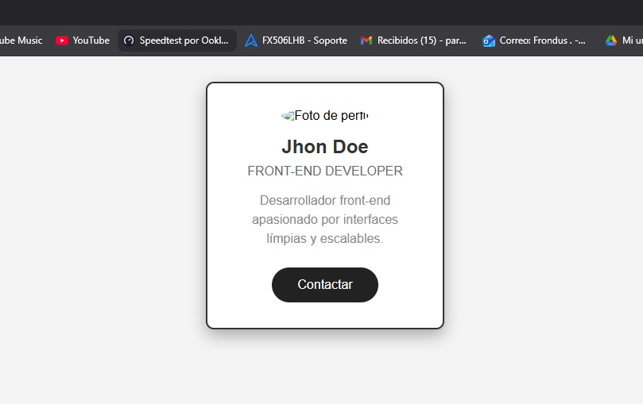

# Análisis Caso: Metodología BEM - Profile Card
**Nicolas Parada** - Sence Bootcamp Front-end Web Dev

## 🚀 Demo Live
[](https://nicolasparadaa.github.io/m3-l2-analisis-de-caso-bem/)

## Introducción y contexto del caso

PixelPerfect Studio enfrenta problemas de escalabilidad en CSS por selectores genéricos y duplicados. Se adopta **BEM** para modularizar estilos en múltiples proyectos.

## Diseño e implementación

Componente elegido: **Profile Card** (adaptado de W3Schools), bloque BEM: `profile-card`.

## Diagnóstico técnico del problema

- **Selectores genéricos**: `.card` afecta múltiples elementos no deseados.
- **Especificidad alta**: `!important` y selectores anidados generan conflictos.
- **Duplicación**: Mismo estilo repetido en varios archivos.
- **Dificultad colaborativa**: Sin convención, cada dev usa su naming.

BEM soluciona con **bloques independientes** (ej: `profile-card`), **elementos** (`__name`) y **modificadores** (`--featured`).

## Metodología elegida (BEM) y comparación breve con OOCSS y SMACSS

| Metodología | Fortalezas | Debilidades | Mejor para |
|-------------|------------|-------------|------------|
| **BEM** | Nombres claros, escalable, sin conflictos | Nombres largos | Equipos grandes, PixelPerfect |
| OOCSS | Reutilización, separa estructura/piel | Abstracta para novatos | UI consistente |
| SMACSS | Flexible, categorías | Menos reglas, inconsistencias | Equipos que definen sus guías |

**Elegimos BEM** porque PixelPerfect tiene **múltiples equipos** y proyectos simultáneos. La nomenclatura explícita (`profile-card__name`) evita colisiones y facilita colaboración.

## Diseño e implementación. (explicar el componente y clases BEM + Estructura SCSS)

**Componente**: Profile Card con foto, nombre, rol, descripción y botón CTA.

**Clases BEM usadas**:
- Bloque: `profile-card`
- Elementos: `__photo`, `__name`, `__role`, `__description`, `__button`
- Modificador: `--featured` (borde + sombra extra)

**Demo**: 

**SCSS aplicado**: Variables (`$primary-color`), nesting, responsive-ready.

## Documentación técnica de la estructura CSS/SCSS.

````markdown
m3-l2-analisis-de-caso-bem/
├── index.html          # HTML semántico + clases BEM
├── styles.css          # CSS compilado (main.scss → sass)
├── README.md           # Esta documentación
└── scss/
    └── main.scss       # Variables + Reset + Bloques BEM

**main.scss organización**:
- **Variables**: `$primary-color`, `$shadow` (líneas 1-3)
- **Reset**: `* { box-sizing: border-box; }`
- **Layout**: `.page`, `.page__section`
- **Componente**: `.profile-card` + modificador `--featured`

## Reflexión final del proceso.

**Desafíos**:
- BEM naming largo pero explícito.

**Beneficios**:
- **0 conflictos** en los estilos entre devs.
- Fácil mantenimiento (`profile-card__name` único), es mas fácil de identificar.
- Escalable a más componentes.

**Impacto colaborativo**: 
El equpo de PixelPerfect encontrarian las clases en segundos.