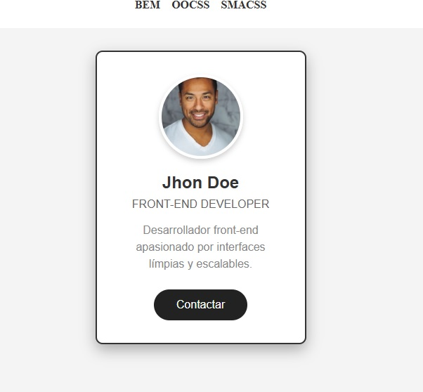
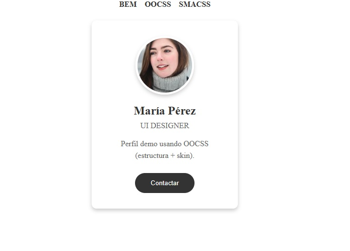
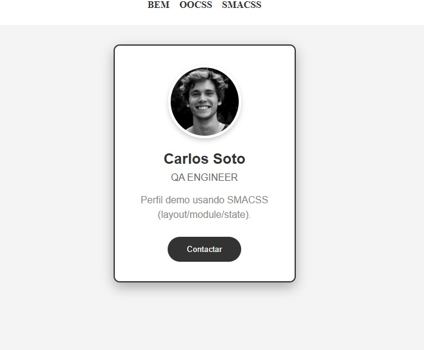

# Análisis Caso: Metodología BEM, OOCSS y SMACSS - Profile Card
**Nicolas Parada** - Sence Bootcamp Front-end Web Dev

## 🚀 Demo Live

- **BEM**: https://nicolasparadaa.github.io/m3-l2-analisis-de-caso-bem/  
  

- **OOCSS**: https://nicolasparadaa.github.io/m3-l2-analisis-de-caso-bem/oocss.html  
  

- **SMACSS**: https://nicolasparadaa.github.io/m3-l2-analisis-de-caso-bem/smacss.html  
  

## Introducción y contexto del caso

PixelPerfect Studio enfrenta problemas de escalabilidad en CSS por selectores genéricos y duplicados. Se adopta **BEM** para modularizar estilos en múltiples proyectos.

## Diseño e implementación

Componente elegido: **Profile Card** (adaptado de W3Schools), bloque BEM: `profile-card`.

## Diagnóstico técnico del problema

- **Selectores genéricos**: `.card` afecta múltiples elementos no deseados.
- **Especificidad alta**: `!important` y selectores anidados generan conflictos.
- **Duplicación**: Mismo estilo repetido en varios archivos.
- **Dificultad colaborativa**: Sin convención, cada dev usa su naming.

Las metodologías mencionadas ayudan a trabajar con estilos más escalables, reduciendo colisiones, duplicación y mejorando la colaboración en equipos.

## Metodología elegida (BEM) y comparación breve con OOCSS y SMACSS

| Metodología | Fortalezas | Debilidades | Mejor para |
|-------------|------------|-------------|------------|
| **BEM** | Nombres claros, escalable, sin conflictos | Nombres largos | Equipos grandes, PixelPerfect |
| OOCSS | Reutilización, separa estructura/skin | Abstracta para novatos | UI consistente |
| SMACSS | Flexible, categorías | Menos reglas, inconsistencias | Equipos que definen sus guías |

**Elegimos BEM** porque PixelPerfect tiene **múltiples equipos** y proyectos simultáneos. La nomenclatura explícita (`profile-card__name`) evita colisiones y facilita colaboración.

## Diseño e implementación. (explicar el componente y clases BEM + Estructura SCSS)

**Componente**: Profile Card con foto, nombre, rol, descripción y botón contacto.

**Implementaciones**:
- **BEM**: `index.html` + `scss/main.scss` → `css/styles.css`
- **OOCSS**: `oocss.html` + `scss/oocss.scss` → `css/oocss.css`
- **SMACSS**: `smacss.html` + `scss/smacss.scss` → `css/smacss.css`

**Clases BEM usadas**:
- Bloque: `profile-card`
- Elementos: `__photo`, `__name`, `__role`, `__description`, `__button`
- Modificador: `--featured` (borde + sombra extra)

**SCSS aplicado**: Variables (`$primary-color`), nesting, responsive-ready.

## Documentación técnica de la estructura CSS/SCSS.

```
m3-l2-analisis-de-caso-bem/
├── index.html
├── oocss.html
├── smacss.html
├── README.md
├── images/
│ ├── avatar.jpg
│ ├── avatar2.jpg
│ ├── avatar3.jpg
│ ├── screenshot_bem.jpg
│ ├── screenshot_oocss.jpg
│ └── screenshot_smacss.jpg
├── css/
│ ├── styles.css
│ ├── oocss.css
│ └── smacss.css
└── scss/
├── main.scss
├── oocss.scss
└── smacss.scss
```

**main.scss organización**:
- **Variables**: `$primary-color`, `$shadow` (líneas 1-3)
- **Reset**: `* { box-sizing: border-box; }`
- **Layout**: `.page`, `.page__section`
- **Componente**: `.profile-card` + modificador `--featured`

## Reflexión final del proceso.

**Desafíos**:
- BEM naming largo pero explícito.

**Beneficios**:
- **0 conflictos** en los estilos entre devs.
- Fácil mantenimiento (`profile-card__name` único), es mas fácil de identificar.
- Escalable a más componentes.

**Impacto colaborativo**: 
El equpo de PixelPerfect encontrarian las clases en segundos.

**Reflexión personal**  

En palabras simples: 

**BEM** es una metodología de nombrado que ayuda a identificar rápidamente a qué componente pertenece cada clase (bloque, elemento y modificador), evitando conflictos y facilitando el mantenimiento.  
**SMACSS** es una guía/arquitectura para escribir CSS de forma escalable clasificando los estilos en categorías como *Base, Layout, Module y State*; esto ayuda tanto a organizar los archivos como a mantener una estructura mental clara del CSS.  
**OOCSS** propone separar “estructura” y “skin”: la estructura define el layout (tamaños, espaciados, distribución) y la skin define lo visual (colores, fondos, sombras), favoreciendo la reutilización.
